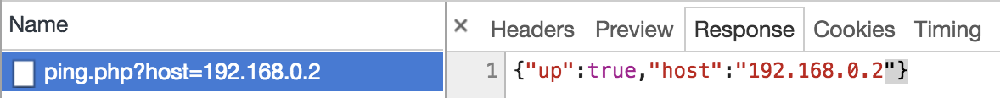
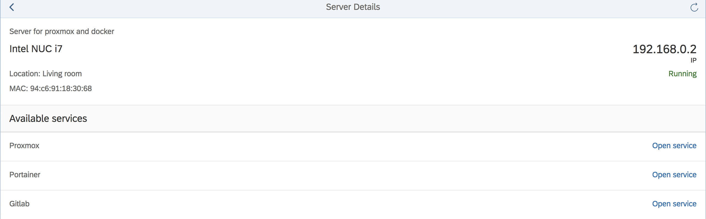

# wol-ui5

> Wake on Lan with OpenUI5

The motivation behind this app is to help myself in accessing and running my own infrastructure. Most of the tools I use to develop are running on a few servers at home. To be able to start them dynamically when I need them and not just run them all the time and to save energy and minimize the monthly bill, I wrote this app to start remotely my servers. I wrote the app in OpenUI5 because I can :-) and to experiment a little bit with CI and OpenUI5. As a result of this I wrote a [karma plugin to report unit test data to Sonarqube](https://github.com/tobiashofmann/karma-sonarqube-generic-reporter). If you want, you can go to that project and check it out. I wrote it because the karma plugins I found were not compatible with SonarQube 7.x and the Generic Test Data import tool used there.

The app is in the status of "works for me". I use it on a weekly basis and while simple, fulfills completely my needs:

* see running status of a server
* start a server
* access service running on server

The app is definitely not made to be used in a data center or for professional monitoring. But it's good enough for me and maybe also for you.

# Architecture

This apps allows you to check the status of your backend servers and to start them remotely using [wake on lan](https://en.wikipedia.org/wiki/Wake-on-LAN). The app consists of two components:

* backend
* frontend

## Components

Browser -- App -- Backend -- Servers

The backend needs to run the app and serve the PHP files. Therefore, PHP must be available. As the PHP scripts are using ping and wakeonlan, both tools must be available on the backend. The backend can be any server that supports these requirements. In my private setup, the software runs on a Raspberry Pi.

Each server that you want to start using WOL msut first be configured to support WOL. Check your specific case on how to enable WOL in the BIOS and how to make sure your operating system supports this too.

## Backend

The app is accessed using a browser, therefore the backend needs to run a web server. Any web server should be sufficient, I am using Apache.

There are two PHP scripts: ping.php and wol.php. Ping is checking if a server is online by pinging it, wol starts a server by sending a magic packet. The backend must have the program wakeonlan installed. 

When a status update is triggered by the app, the script ping.php is called with parameter host that provides the IP to be pinged.



The services returns a JSON response with the result of the ping. In case the server is responding to a ping, up is set to true. 

```json
{"up":true,"host":"192.168.0.2"}
```

## Frontend

The app is developed in [OpenUI5](https://www.openui5.org) and presents the user with a list of available servers and services. For each server, the up status is shown and in case the server is configured for WOL, it can be woke up via the app interface. 

The list of servers and services is defined in a JSON document inside the app: server.json. Each server defined here is shown on the main screen of the app. For each server, a list of services available on this server can be specified. This allows to navigate directly from the app to each service.

## Security

The app should not be made acessible on the internet without having the user to authenticate. At least BASIC authentication to access the App and the PHP scripts is needed. Create a .htpasswd file for basic protection of the resource.

# Installation

Copy the files to a directory that is served by your web server. Ensure ping and wakeonlan are installed. The web server must be able to run PHP scripts. Configure your web server to serve the app from the desired location, for instance /wol-ui5. Define your own servers in the servers.json file. 

## Run

Use a browser and access the URL of your web server and the app path. 

```sh
https://your.server.tld/wol-ui5
```


# Example

## Overview page listing all servers

Start page of the app: 


Detail page for a specific server:



## Detail page

The detail page lists the status of a single server and the available services on this server. Here the computer can be started via wake on lan.

The server.json file for two dummy services and three services running on the last server.

```json
{
    "servers" : [
    {
        "name": "Server",
        "location": "basement",
        "description": "lorem ipsum",
        "ip": "1.1.1.1",
        "mac": "aa:bb:cc:00:11:22",
        "broadcast": "1.1.1.255",
        "running": false,
        "services": [
            {
                "name": "Web",
                "url" : "1.1.1.2",
                "protocol": "http",
                "port": 8080,
                "uri": "/"
            }
            ]
    },
    {
        "name": "Datacenter",
        "location": "somehwere",
        "description": "lorem ipsum",
        "ip": "2.2.2.2",
        "mac": "aa:bb:cc:00:11:33",
        "broadcast": "2.2.2.255",
        "running": false, 
        "services": [
            {
                "name": "Web server",
                "url" : "web.example.com",
                "protocol": "https",
                "port": 443,
                "uri": "/"
            },
            {
                "name": "Database",
                "url" : "db.example.com",
                "protocol": "https",
                "port": 443,
                "uri": "/"
            },
            {
                "name": "Gitlab",
                "url" : "gitlab.example.com",
                "protocol": "https",
                "port": 443,
                "uri": "/"
            }
        ]
    }
    ]
}
```


## Run tests

The app includes unit tests with OpenUI5 and karma. You need to run the tests from the frontend directory.

```bash
cd frontend
npm install
karma start
```

